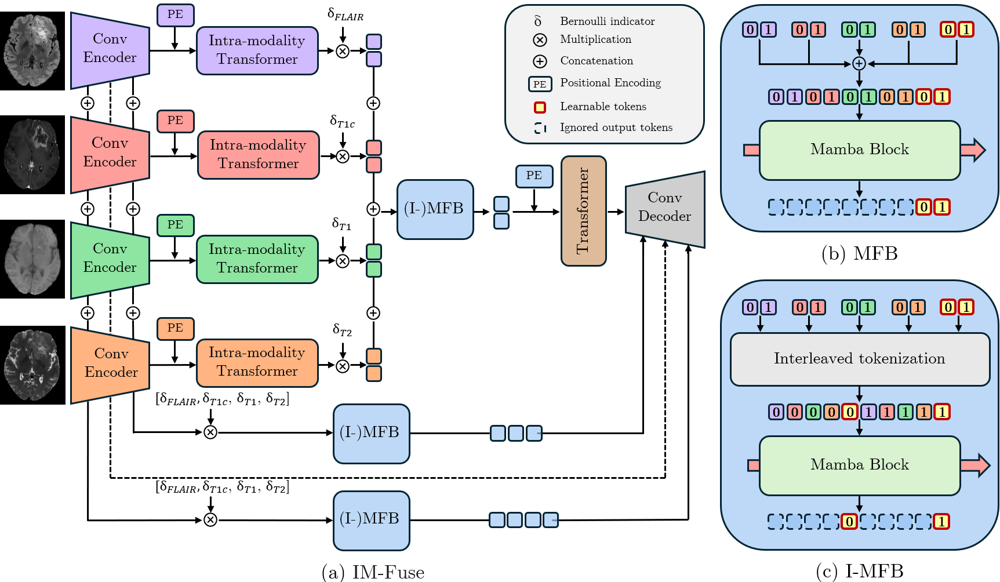

# IM-Fuse: A Mamba-based Fusion Block for Brain Tumor Segmentation with Incomplete Modalities
[[Paper]](https://federicobolelli.it/pub_files/2025miccai_imfuse.pdf) [[Bib]](https://federicobolelli.it/pub_files/2025miccai_imfuse.html)

<figure>
 
 <figcaption><em>Overview of our framework IM-Fuse (Incomplete Modality Fusion), (b) represents our Mamba Fusion Block (MFB) where learnable tokens are concatenated, and (c) depicts its interleaved version (Interleaved-MFB or I-MFB) where modality tokens and learnable parameters are alternately arranged.</em></figcaption>
</figure>

This repository contains the material from the paper "IM-Fuse: A Mamba-based Fusion Block for Brain tumor Segmentation with Incomplete Modalities".It includes all materials necessary to reproduce our framework, as well as the competitors evaluated on the [BraTS 2023](https://www.synapse.org/Synapse:syn51156910/wiki/) dataset for the glioma segmentation task.

## Introduction
Brain tumor segmentation is a crucial task in medical imaging that involves the integrated modeling of four distinct imaging modalities to accurately delineate tumor regions. Unfortunately, in real-life scenarios, the complete acquisition of all four modalities is frequently hindered by factors such as scanning costs, time constraints, and patient condition. To address this challenge, numerous deep learning models have been developed to perform brain tumor segmentation under conditions of missing imaging modalities. 

Despite these advancements, the majority of existing models have been evaluated primarily on the 2018 edition of the BraTS dataset, which comprises only $285$ volumes. In this study, we reproduce and conduct an extensive analysis of the most relevant models using the [BraTS 2023](https://www.synapse.org/Synapse:syn51156910/wiki/) dataset, which includes $1,250$ volumes. This larger and more diverse dataset enables a more robust and comprehensive comparison of model performance.

Moreover, we introduce and evaluate the use of Mamba as an alternative fusion mechanism for brain tumor segmentation in scenarios involving missing modalities. Experimental results indicate that transformer-based architectures achieve superior performance on the [BraTS 2023](https://www.synapse.org/Synapse:syn51156910/wiki/) dataset, outperforming purely convolutional models that previously demonstrated state-of-the-art results on BraTS2018. Notably, the proposed Mamba-based architecture exhibits promising performance compared to state-of-the-art models, competing and even outperforming transformers.

## Citing our work
If you find this code and paper useful for your research, please kindly cite our paper.
```
@inproceedings{2025MICCAI_imfuse,
	publisher={Springer},
	venue={Daejeon, South Korea},
	month={May},
	year={2025},
	pages={1--11},
	booktitle={28th International Conference on Medical Image Computing and Computer Assisted Intervention},
	title={{IM-Fuse: A Mamba-based Fusion Block for Brain Tumor Segmentation with Incomplete Modalities}},
	author={Pipoli, Vittorio and Saporita, Alessia and Marchesini, Kevin and Grana, Costantino and Ficarra, Elisa and Bolelli, Federico},
}
```

## Dataset
Before running this project, you need to download the data from BraTS 2023 Challenge, specifically the subset for [Glioma Segmentation](https://www.synapse.org/Synapse:syn51156910/wiki/622351) task.

## IM-Fuse
### How to run
Clone this repository, create a python env for the project and activate it. Then install all the dependencies with pip.
```
git clone git@github.com:AImageLab-zip/IM-Fuse.git
cd IMFuse
python -m venv imfuse_venv
source imfuse_venv/bin/activate
pip install -r requirements.txt
```
### Preprocess data
Set the data paths in `preprocess.py` and then run `python preprocess.py`.

### Training
Run the training script `train_poly.py` with the following arguments:
```
python train_poly.py \
  --datapath <PATH>/BRATS2023_Training_npy \   # Directory containing BRATS2023 .npy files
  --num_epochs 1000 \                          # Total number of training epochs
  --dataname BRATS2023 \                       # Dataset identifier
  --savepath <OUTPUT_PATH> \                   # Directory for saving checkpoints 
  --mamba_skip \                               # Using Mamba in the skip connections
  --interleaved_tokenization                   # Enable interleaved tokenization
```

### Test
Run the test script `test.py` with the following arguments:
```
python test.py \
  --datapath <PATH>/BRATS2023_Training_npy \   # Directory containing BRATS2023 .npy files
  --dataname BRATS2023 \                       # Dataset identifier
  --savepath <OUTPUT_PATH> \                   # Directory for saving results
  --resume <RESUME_PATH> \                     # Path to the checkpoints 
  --mamba_skip \                               # Using Mamba in the skip connections
  --batch_size 2 \                             # Batch size
  --interleaved_tokenization                   # Enable interleaved tokenization
```

## How to Run Competitor Models
We provide implementations for evaluating the primary competitor models on the BraTS 2023 dataset. Please consult the respective README files for detailed instructions on installation, usage, and reproduction of results.
- [Missing as Masking](MaM/README.md)
- [M3AE](m3ae/README.md)
- [ShaSpec](ShaSpec/README.md)
- [SFusion](SFusion/README.md)
- [mmFormer](mmFormer/README.md)
- [Robust-MSeg](RobustSeg/README.md)
- [U-HVED](UHVED/README.md)

## References
* [Missing as Masking: Arbitrary Cross-modal Feature Reconstruction for Incomplete Multimodal Brain Tumor Segmentation](https://papers.miccai.org/miccai-2024/paper/0067_paper.pdf)
* [M3AE: Multimodal Representation Learning for Brain Tumor Segmentation with Missing Modalities](https://github.com/ccarliu/m3ae)
* [Multi-modal Learning with Missing Modality via Shared-Specific Feature Modelling](https://github.com/billhhh/ShaSpec)
* [SFusion: Self-attention based N-to-One Multimodal Fusion Block](https://github.com/scut-cszcl/SFusion)
* [mmformer: Multimodal medical transformer for incomplete multimodal learning of brain tumor segmentation](https://github.com/YaoZhang93/mmFormer)
* [Hetero-Modal Variational Encoder-Decoder for Joint Modality Completion and Segmentation](https://github.com/ReubenDo/U-HVED)
* [Robust Multimodal Brain Tumor Segmentation via Feature Disentanglement and Gated Fusion](https://github.com/cchen-cc/Robust-Mseg)

