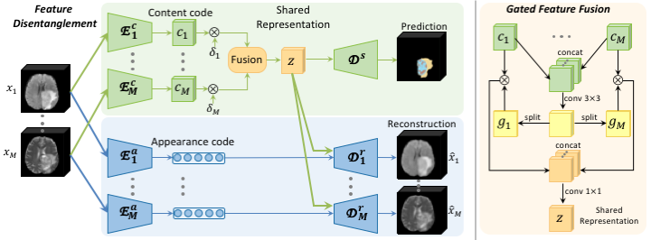

# Robust Multimodal Brain Tumor Segmentation via Feature Disentanglement and Gated Fusion
[[Paper]](https://arxiv.org/abs/2002.09708) [[Code]](https://github.com/cchen-cc/Robust-Mseg) MICCAI 2019
<p align="center">
  
</p>
✅ Tested at commit: 
8359e49

## Requirements
Code was tested using:
```
python==3.10.12
torch==2.7.1
```
## How to run
Run mmFormer using the same Python environment and data preprocessing setup as [IM-Fuse](/IMFuse/README.md). Please refer to that guide for detailed instructions on how it is done.
```
cd RobustSeg
source ../IMFuse/imfuse_venv/bin/activate
```

## Training
Run the training script `train_robustseg.py` with the following arguments:
```
python train_robustseg.py \
  --datapath <PATH>/BRATS2023_Training_npy \   
  --num_epochs 300 \                           
  --dataname BRATS2023 \                       
  --savepath <OUTPUT_PATH> \                   
  --batch_size 1                               
```

## Test
Run the test script `test_robustseg.py` with the following arguments:
```
python test_robustseg.py
  --datapath <DATASET_DIRECTORY> \
  --resume <CHECKPOINT_PATH> \
  --savepath <RESULTS_FILE_PATH>
```