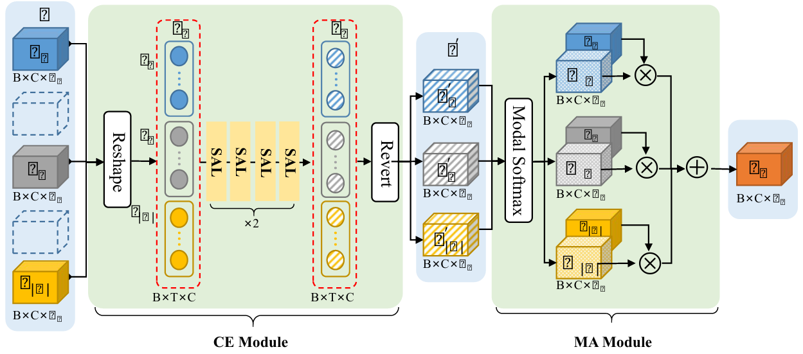

# SFusion: Self-attention based N-to-One Fusion Block
[[Paper]](https://arxiv.org/abs/2208.12776) [[Code]](https://github.com/scut-cszcl/SFusion) MICCAI 2023
<p align="center">
  
</p>


## Requirements
Code was tested using:
```
python==3.10.12
torch==2.7.1
```
## How to run
Run mmFormer using the same Python environment and data preprocessing setup as [IM-Fuse](/IMFuse/README.md). Please refer to that guide for detailed instructions on how it is done.
```
cd SFusion
source ../IMFuse/imfuse_venv/bin/activate
```

## Training
Run the training script `train_sfusion.py` with the following arguments:
```
python train_sfusion.py \
  --datapath <PATH>/BRATS2023_Training_npy \   
  --num_epochs 200 \                           
  --dataname BRATS2023 \                       
  --savepath <OUTPUT_PATH> \                    
  --batch_size 1                               
  --feature_maps 16                            
```

## Test
Run the test script `test_sfusion.py` setting the data path and the path to the checkpoint in the script.

python test_sfusion.py
  --datapath <DATASET_DIRECTORY> \
  --resume <CHECKPOINT_PATH> \
  --savepath <RESULTS_FILE_PATH>
```
