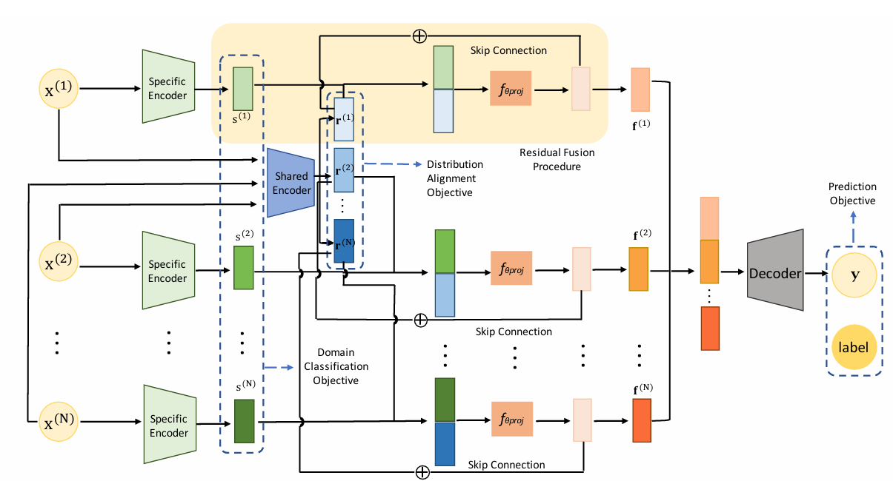

# Multi-modal Learning with Missing Modality via Shared-Specific Feature Modelling  

[[Paper]](https://arxiv.org/pdf/2307.14126) [[Code]](https://github.com/billhhh/ShaSpec)  CVPR2023

<p align="center">
  
</p>
✅ Tested at commit: 
8359e49

## Requirements
Code was tested using:
```
python==3.10.12
torch==2.7.1
```

## How to run
Clone this repository, create a python environment for the project and activate it. Then install all the dependencies with pip.
```
cd ShaSpec
python -m venv shaspec_venv
source shaspec_venv/bin/activate
pip install -r requirements.txt
```

## Warm up
Perform a warm up with all modalities `train_SS.py` with the following arguments:
```
python train_SS.py \
--snapshot_dir snapshots/BraTS23_ShaSpec_warmup \
--batch_size 1 \
--num_gpus 1 \
--num_steps 245000 \
--val_pred_every 875 \
--learning_rate 1e-2 \
--num_classes 3 \
--num_workers 4 \
--train_list BraTS23/BraTS23_train.csv \
--val_list BraTS23/BraTS23_val15splits.csv \
--test_list BraTS23/BraTS23_test15splits.csv \
--random_mirror \
--random_scale \
--weight_std \
--warm_up 
```

## Training
Run the training script `train_SS.py` with the following arguments:
```
python train_SS.py \
  --snapshot_dir /snaphots/BraTS23_ShaSpec_training \
  --batch_size 1 \
  --num_gpus 1 \
  --num_steps 406000 \
  --val_pred_every 875 \
  --learning_rate 1e-2 \
  --num_classes 3 \
  --num_workers 4 \
  --train_list BraTS23/BraTS23_train.csv \
  --val_list BraTS23/BraTS23_val15splits.csv \
  --test_list BraTS23/BraTS23_test15splits.csv \
  --random_mirror \
  --random_scale \
  --weight_std \
  --mode random \
  --reload_path ShaSpec/snapshots/BraTS23_ShaSpec_warmup/best.pth \
  --reload_from_checkpoint
```

## Test
Run the test script `eval.py` with the following arguments:
```
python eval.py \
  --num_classes 3 \
  --data_list BraTS23/BraTS23_test.csv \
  --weight_std \
  --restore_from /work/grana_neuro/missing_modalities/ShaSpec/snapshots/BraTS23_ShaSpec_training/final.pth \
  --mode <MODE>
```
where `<MODE>` indicates the missing modality scenario. In the command above, replace `<MODE>` with one of the following missing‑modality configurations to evaluate every scenario:
```
0
0,1
0,1,2
0,1,2,3
0,1,3
0,2
0,2,3
0,3
1
1,2
1,2,3
1,3
2
2,3
3
```
