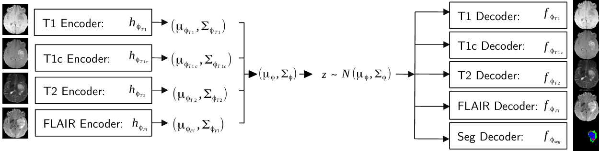

# U-HVED
[[Paper]](https://arxiv.org/abs/1907.11150) [[Code]](https://github.com/ReubenDo/U-HVED) MICCAI 2019
<p align="center">
  
</p>

✅ Tested at commit: 
8359e49

## How to run
Run U-HVED using the same data preprocessing of IM-Fuse and creating the following python environment:
```
cd UHVED
python -m venv uhved_venv
source uhved_venv/bin/activate
pip install -r requirements.txt
```

## Training
Run the training script `train_uhved.py` with the following arguments:
```
python train_uhved.py \
  --datapath <PATH>/BRATS2023_Training_npy \   
  --num_epochs 400 \                           
  --dataname BRATS2023 \                       
  --savepath <OUTPUT_PATH> \                   
  --batch_size 1                               
```

## Test
Run the test script `test_uhved.py` with the following arguments:
```
python test_uhved.py
  --datapath <DATASET_DIRECTORY> \
  --resume <CHECKPOINT_PATH> \
  --savepath <RESULTS_FILE_PATH>
```
