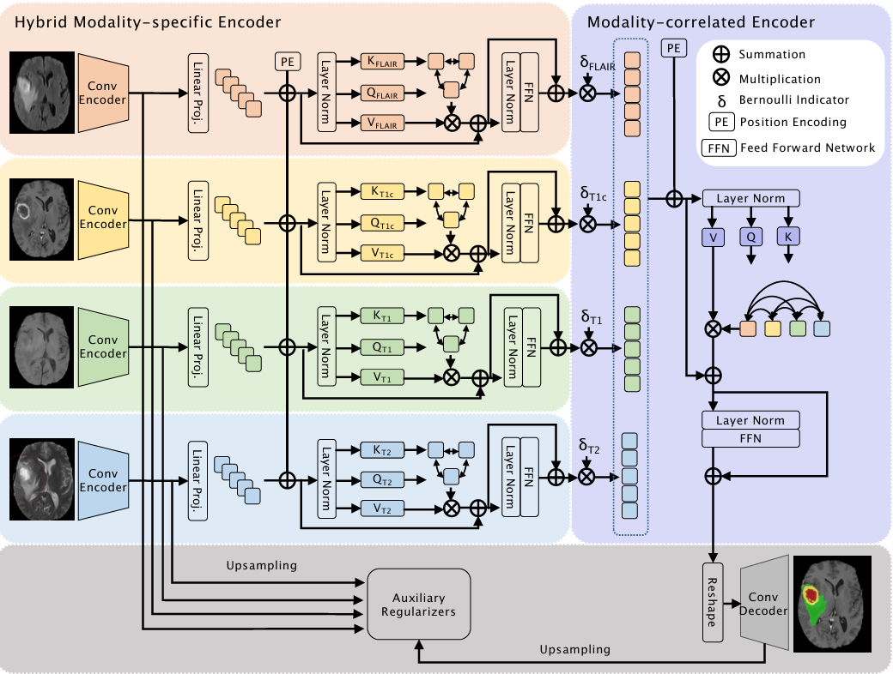

# mmFormer: Multimodal Medical Transformer for Incomplete Multimodal Learning of Brain Tumor Segmentation

[[Paper]](https://arxiv.org/abs/2206.02425) [[Code]](https://github.com/YaoZhang93/mmFormer) MICCAI 2022 

<p align="center">
  
</p>

## Requirements
Code was tested using:
```
python==3.10.12
torch==2.7.1
```
## How to run
Run mmFormer using the same Python environment and data preprocessing setup as [IM-Fuse](/IMFuse/README.md). Please refer to that guide for detailed instructions on how it is done.


## Training
Remember to activate the right virtual environment:
```
cd mmFormer
source ../IMFuse/imfuse_venv/bin/activate
```
Run the training script `train.py` with the following arguments:
```
python train.py \
  --datapath <PATH>/BRATS2023_Training_npy \   
  --num_epochs 1000 \                          
  --dataname BRATS2023 \                       
  --savepath <OUTPUT_PATH> \                   
  --batch_size 3                               
```

## Test
Run the test script `test.py` with the following arguments:
```
python test.py
  --datapath <DATASET_DIRECTORY> \
  --resume <CHECKPOINT_PATH> \
  --savepath <RESULTS_FILE_PATH>
```